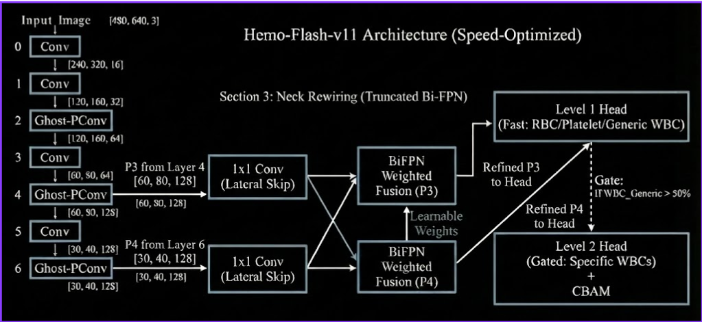

# 🩸 Hemo-Flash: Real-Time Hematological Anomaly Detection

**Hemo-Flash** is a lightweight, high-performance computer vision system designed to detect and classify blood cells in real-time. Built on a custom **YOLOv11** architecture, it specifically addresses the challenge of **domain adaptation** across different microscope standards by utilizing **CLAHE** (Contrast Limited Adaptive Histogram Equalization) and a unified hierarchical label map.

   

## 🚀 Key Features

* **Multi-Source Dataset Fusion:** Successfully merges three disparate datasets (**BCCD**, **Raabin-WBC**, **Sickle-Cell**) into a single coherent training set.
* **Advanced Preprocessing (CLAHE):** A detailed normalization pipeline that converts images to LAB color space to equalize contrast without corrupting the critical purple/pink chromatin stain colors.
* **Custom "Hemo-Flash" Architecture:** A modified YOLOv11 backbone replacing standard Convolutions with **GhostConvolutions**, significantly reducing parameter count for edge/browser deployment without sacrificing accuracy.
* **Hierarchical Classification:** Simultaneously detects generic cells (RBC, WBC, Platelets) and specific pathologies (Sickle Cells) or subtypes (Neutrophils, Eosinophils, etc.).

##  The "Remastered" Dataset

One of the core challenges in hematology AI is that every lab's microscope has different lighting. We solved this with a custom ETL pipeline:

1.  **Ingestion:** Raw data pulled from Roboflow (BCCD, Raabin, Sickle Cell).
2.  **Sanitization:** Fixed inconsistent labeling.
3.  **Normalization:** Applied **CLAHE** to the L-channel (Lightness) only. This ensures that dark smears (Raabin) and bright smears (BCCD) look visually consistent to the model.

**Classes (9 Total):**

| ID | Class Name | Description |
| :--- | :--- | :--- |
| 0 | `RBC_Normal` | Healthy Red Blood Cells |
| 1 | `RBC_Sickle` | Sickle Cell Anemia Pathologies |
| 2 | `Platelets` | Thrombocytes for clotting |
| 3 | `WBC_Base` | Generic White Blood Cell (if subtype unclear) |
| 4 | `Neutrophil` | WBC Subtype |
| 5 | `Eosinophil` | WBC Subtype |
| 6 | `Basophil` | WBC Subtype |
| 7 | `Monocyte` | WBC Subtype |
| 8 | `Lymphocyte` | WBC Subtype |

## 🧠 Model Architecture: Hemo-Flash v1

We utilize a custom YAML configuration (`hemoflash_v1.yaml`) to build the model from scratch.

* **Backbone:** Custom GhostNet-inspired backbone.
* **Head:** YOLOv11 Detect Head.
* **Optimization:** Uses `GhostConv` layers to reduce FLOPs, making the model suitable for deployment on standard CPUs or web browsers (via WebAssembly/Pyodide).

## 🛠️ Installation

```bash
# Clone the repository
git clone [https://github.com/Sharukesh3/Hemo-Flash.git](https://github.com/Sharukesh3/Hemo-Flash.git)
cd hemo-flash

# Install dependencies
pip install ultralytics opencv-python-headless roboflow tqdm pyyaml
